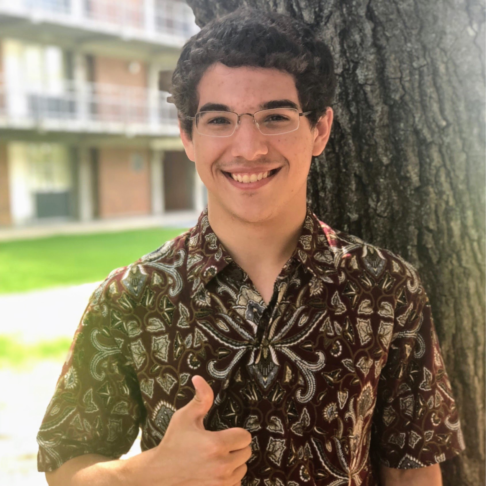

<figure style="float:right;">
        
</figure>

## About Me
Hi. My name is William Luke. I'm an undergraduate student at Texas A&M University studying computer engineering. When I'm not studying, I work as a Linux sysadmin for Texas A&M College of Engineering IT.

## Contact
The best way to contact me is by email.
<dl>

    <dt>Personal Email: </dt>
    <dd> <strong> william.luke@silverknoll.net </strong> </dd>
    <dd>PGP: <a style="color: blue" href="williamluke.gpg">Stand by...</a></dd>
    

    <dt>University Email:</dt>
    <dd> <strong> william.luke21@tamu.edu </strong> </dd>

</dl>

## Interests
I enjoy working on software projects with involving networking and multithreading. In my free time I experiment with various projects on Linux distributions. Mostly I try out projects authored by others, but I have been starting to dabble in writing my own projects as my programming ability grows.